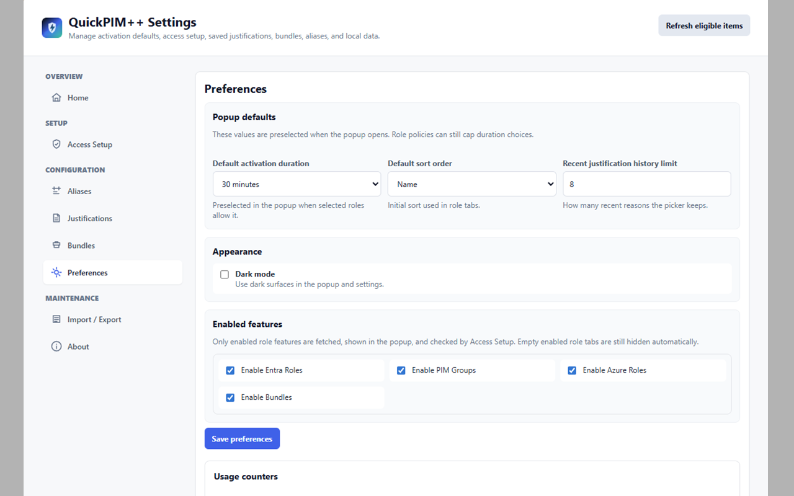
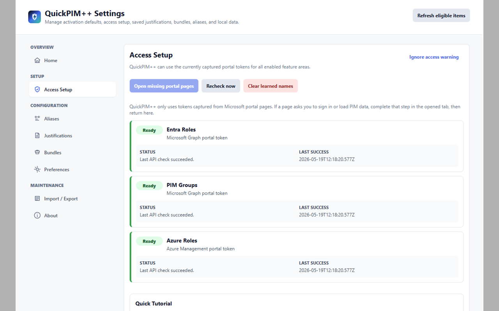

# QuickPIM++

QuickPIM++ is a Microsoft Edge and Chrome MV3 extension for activating Microsoft Privileged Identity Management access faster from a compact browser popup.

It brings Microsoft Entra roles, PIM-enabled groups, and Azure resource roles into one local-first activation console with saved justifications, favorites, bundles, aliases, learned names, and a cleaner settings experience.

Current version: **v2.10.13**

Original author: Daniel Bradley. QuickPIM++ continues the original [QuickPIM](https://github.com/DanielBradley1/QuickPIM) project with later community contributions and the v2 React/TypeScript rewrite.

## Why QuickPIM++ Exists

Microsoft PIM is useful, but the portal flow can be slow when you frequently need short-lived access across several Entra roles, Azure scopes, or PIM groups. QuickPIM++ keeps the security model of just-in-time activation while reducing the repeated portal navigation needed for daily work.

The extension does not create a separate OAuth app registration and does not ask you to paste tokens. It works with Microsoft portal tokens that are already available in your signed-in browser profile, then degrades gracefully when a portal token or API capability is unavailable.

## Highlights

- Activate eligible Microsoft Entra roles, Azure resource roles, and PIM-enabled groups.
- Disable active Microsoft Entra roles, Azure resource roles, and PIM-enabled groups before expiry when Microsoft exposes the needed schedule identifiers.
- See friendly role, group, subscription, admin unit, device, and scope names when Microsoft APIs expose them.
- Keep learned display names locally so old friendly names still work when later token access is limited.
- Override names with local aliases when Microsoft returns opaque IDs or when your organization uses clearer internal naming.
- Mark roles and groups as favorites and keep them at the top of each tab.
- Build activation bundles that can include Entra roles, PIM groups, and Azure roles.
- Skip already-active bundle entries automatically to avoid duplicate activation failures.
- Keep enable and disable selections separate so a popup request does one clear operation at a time.
- Reuse saved justifications and recent justification history.
- Block generic audit justifications such as `BAU`, `Admin`, or `needed`.
- Append `{Activated using QuickPIM++}` to submitted justifications without adding it to the text field.
- Sort and filter by name, scope, last use, activation count, and other useful fields.
- Use quick filter chips for favorites, eligible items, active items, and roles that require a reason.
- Review compact row policy details such as maximum duration, approval, ticket, required reason, active-until date, and disable availability.
- Preflight bundle activation to show actionable, skipped, pending, and blocked entries before sending requests.
- Track local activation and deactivation activity with searchable Settings history.
- Follow requests submitted by QuickPIM++ from pending approval through provisioning, activation, completion, denial, or failure.
- Click a tracked request to inspect its Microsoft request ID, status, dates, duration, scope, reason, and sanitized error details.
- Prepare a failed request for retry or an active request for early disable directly from its details without sending anything automatically.
- Show the number of unresolved QuickPIM++ requests on the toolbar badge.
- Optionally notify when a request changes state or an activation is close to expiry; notification access is disabled by default.
- Keep captured Microsoft portal tokens in session-only browser storage while preserving non-sensitive settings and caches locally.
- Background-refresh portal tokens and stale role data every 10 minutes when an existing Entra tab can provide them, with a setting to disable it.
- Use richer Access Setup diagnostics for feature-specific success, failure, stale, and limited states.
- Hide activation counters and last enablement dates by default, with preferences to show them when useful.
- See a live remaining-time counter on PIM-activated roles, with an option to hide it.
- Enable only the feature areas you use, skip disabled feature fetches, and automatically omit empty role-type tabs.
- Use dark mode from settings.
- Import and export local settings as JSON.
- View a GitHub-backed changelog from the settings home page.

## What You Can Activate

### Microsoft Entra Roles

QuickPIM++ reads eligible Entra role assignments from Microsoft Graph and can activate or disable directory roles from the popup. It resolves directory role names, detects active roles, displays active status in the relevant role tab, and can show scoped assignments such as tenant, administrative unit, or device scopes with friendly display names when available.

### PIM Groups

QuickPIM++ supports PIM-enabled groups for both member and owner eligibilities. Group display names are learned and cached locally, and group enable/disable requests use the Graph PIM group schedule request APIs.

### Azure Roles

QuickPIM++ supports Azure resource PIM roles from Azure Management APIs. It resolves role definition names, subscription names, inherited scopes, activation policies, and active assignments where the captured portal token allows it.

## Popup Experience

The popup is designed for daily activation:

- Token status for Graph and Azure Management.
- Access warning banner only when a feature area is stale or limited.
- Separate tabs for Entra Roles, PIM Groups, Azure Roles, and Bundles.
- Search and sort controls with compact icons.
- Refresh and portal-link actions in the top control area, with visible refresh progress.
- Manual refresh shows progress, and background pre-refresh keeps tokens and cached data ready when possible.
- Favorite stars on role rows.
- Quick filter chips to narrow the current tab without leaving the popup.
- Row click selection, plus checkbox selection.
- Active rows can be selected for early disable, while eligible rows are selected for activation.
- Enable and disable selections are mutually exclusive until the selection is cleared.
- Activation review step shown only after pressing `Continue`.
- Disable review skips the duration picker and keeps a two-line optional justification field.
- Duration options capped to what the selected roles or groups allow.
- Justification, ticket system, and ticket number fields shown only when required by selected items.
- Clear progress and completion/error feedback during activation.
- Per-row action reasons explain why a row is selectable, read-only, pending, or missing disable metadata.

## Settings Experience

Settings are organized around setup, configuration, and local data:

- **Home** - brief product overview, quick links, and dynamically loaded GitHub changelog.
- **Access Setup** - guided portal refresh flow for missing or limited feature areas.
- **Activity** - request lifecycle details plus searchable local activation/deactivation history.
- **Aliases** - local display-name overrides for roles, groups, and scopes.
- **Justifications** - saved justification templates and recent history controls.
- **Bundles** - create, edit, duplicate, and remove role/group bundles.
- **Preferences** - activation defaults, recent-history limits, dark mode, and enabled feature areas.
- **Import / Export** - move local configuration between browser profiles.
- **About** - version, attribution, repository links, and local privacy note.



## Access Setup

QuickPIM++ uses portal-driven access. When it needs a fresh token or a feature area is limited, use **Settings > Access Setup** and choose **Open missing portal pages**.

The popup, background alarm, and guided setup share one bounded scan of already-open Entra admin center tabs for fresh portal tokens. Concurrent scans are deduplicated, and a renewed token with the same tenant, user, and API scopes keeps compatible cached role data. Access Setup opens only the Microsoft portal pages still needed for enabled feature areas that remain missing or limited. Recovery pages open inactive in a collapsed **QuickPIM++ access refresh** tab group, so the popup or Settings page stays in place:

- Entra roles
- PIM groups
- Azure roles

QuickPIM++ closes temporary recovery pages after a newer usable token is captured or the matching feature API refresh succeeds. When all tracked targets finish together, their tab IDs are removed as one batch and the empty group disappears. A ten-minute safety timeout cleans up an abandoned recovery group. If Microsoft requires sign-in, tenant selection, or another prompt, QuickPIM++ keeps that recovery state available after the popup closes and offers a **Continue sign-in** action that expands the temporary group. Role loading resumes automatically after access is captured. A recovery tab moved outside its managed group is left open and untracked.



## Privacy And Security Model

QuickPIM++ is local-first:

- Tokens are stored only in session storage for the current local browser session and are cleared when that session ends.
- Settings, aliases, learned names, favorites, bundles, and justification history are local Chrome storage data.
- Tracked request identifiers, status, bounded diagnostics, and activity history stay in local Chrome storage; raw API responses and tokens are not retained there.
- The extension only calls Microsoft Graph and Azure Management for PIM operations.
- Disabled role features are skipped during refreshes and Access Setup checks.
- Existing Entra admin center tabs are scanned before Access Setup opens more portal pages.
- Temporary recovery pages are inactive, grouped, and closed after token recovery or a successful matching API refresh, with a ten-minute cleanup fallback.
- QuickPIM++ does not request browser cookie access. Microsoft session cookies can help an open portal renew its own session, while the extension captures only validated Graph or Azure bearer tokens that the portal makes available.
- The settings home page calls the public GitHub API only to show repository changelog entries.
- Runtime messages, imported settings, activation inputs, JWTs, and API URLs are validated before privileged background actions run.
- API errors shown in the UI are sanitized so token-like values and oversized raw messages are not surfaced.

The extension intentionally relies on captured Microsoft first-party portal tokens. A compromised browser profile or malicious extension with broad access to your browser can still be a risk, so keep your browser profile and installed extensions trusted.

## Browser Installation

Build the extension first:

```bash
npm install
npm run build
```

Then load the built extension:

1. Open `edge://extensions` or `chrome://extensions`.
2. Enable **Developer mode**.
3. Choose **Load unpacked**.
4. Select the `dist/` folder from this repository.
5. Pin QuickPIM++ to the browser toolbar.
6. Open Microsoft Entra or Azure Portal, sign in, then run **Settings > Access Setup**.

## Development

Requirements:

- Node.js 24 or newer
- npm 11.6.2 (the CI and release workflows pin this version for lockfile reproducibility)
- Microsoft Edge or another Chromium browser for manual extension testing

Install dependencies:

```bash
npm install
```

Run unit and UI tests:

```bash
npm test
```

Type-check and build:

```bash
npm run build
```

Audit dependencies:

```bash
npm audit --audit-level=low
```

Run `node scripts/check-version-sync.mjs` to verify package, lockfile, manifest, runtime metadata, README, security review, and release-tag versions remain synchronized.

## Release Automation

Pushing a `v*` tag checks the exact tagged commit, reruns type checking, tests, dependency audit, and the production build, creates an immutable GitHub release ZIP, and submits that same verified ZIP to the Chrome Web Store automatically.

Chrome Web Store publishing requires these GitHub repository secrets and fails visibly instead of silently skipping deployment when any value is missing:

- `CHROME_WEBSTORE_CLIENT_ID`
- `CHROME_WEBSTORE_CLIENT_SECRET`
- `CHROME_WEBSTORE_REFRESH_TOKEN`
- `CHROME_WEBSTORE_PUBLISHER_ID`
- `CHROME_WEBSTORE_EXTENSION_ID`

To create the credentials, enable the Chrome Web Store API in Google Cloud, create an OAuth web client, and generate a refresh token for the `https://www.googleapis.com/auth/chromewebstore` scope. Google documents the same flow in the official Chrome Web Store API guide: <https://developer.chrome.com/docs/webstore/using-api>.

Once the secrets are present, the release workflow uploads `release/quickpim-plusplus-vX.Y.Z-chrome-webstore.zip` to the existing Chrome Web Store item and calls the publish endpoint, which submits the update for Chrome review.

## Manual Verification

After building and loading `dist/`, verify:

- Graph and Azure token statuses appear in the popup header.
- Access Setup opens only the portal pages needed for missing or limited feature areas.
- Refresh shows progress, and the popup refresh icon spins while data is being refreshed.
- Eligible Entra roles, Azure roles, and PIM groups render with friendly names.
- Admin unit, device, subscription, and inherited Azure scope names display when available.
- Search, sort, favorites, enabled features, and dark mode persist after reopening.
- A single role or group activation submits successfully with the required duration and justification.
- An active role or group can be selected and disabled before expiry when Microsoft exposes the active schedule identifiers.
- Activation and deactivation selections cannot be mixed in one request.
- Already-active items show as `active` and show remaining time when available.
- Bundles activate only eligible inactive entries and skip already-active entries.
- Saved justifications and recent justification history update in both popup and settings.
- Import/export preserves aliases, justifications, bundles, favorites, preferences, and learned names.

## Limitations

- QuickPIM++ cannot activate access that Microsoft PIM policy or Azure RBAC denies.
- Roles protected by authentication contexts may still require interactive Microsoft portal steps.
- Microsoft API responses differ by tenant, policy, role type, and portal token capability, so some names or policy limits are best-effort.
- If a portal token expires or does not expose a feature area, QuickPIM++ uses cached eligible data and learned display names where possible, then asks you to refresh portal access.

## Repository Hygiene

- Source lives under `src/`.
- Static extension assets live under `public/`.
- Tests live under `tests/`.
- Production builds go to `dist/` and are ignored by git.
- Dependencies in `node_modules/` are ignored by git.
- Security review notes live in `SECURITY_REVIEW.md`.

## Changelog

### v2.10.13

- Keeps the v2.10.12 durable request, token recovery, filter-clear, and build-time improvements unchanged.
- Aligns the Preferences autosave navigation check with the page's interactive-ready boundary while still verifying an immediate, non-blocking save on navigation.

### v2.10.12

- Keeps activation and deactivation requests running in the background when the popup closes, then reconnects to their progress and result when it reopens.
- Recovers missing capability-specific portal tokens automatically and retries only requests proven not to have reached Microsoft, avoiding duplicate privileged-access writes.
- Selects the strongest target-specific Graph token, rejects near-expiry or account-mismatched write tokens, and preserves partial successes during recovery.
- Adds a compact clear button to popup search and ignores local `SessionExport` captures so bearer tokens and cookies cannot be committed accidentally.
- Shows the exact UTC artifact build date and time in Settings > About.

### v2.10.11

- Treats token, permission, and interactive-auth limitations as feature-specific Access warnings instead of leaving an otherwise successful role refresh in a red failure state.
- Keeps real transport and data-source failures red, and shows the green Refresh completion badge only when every enabled role source is fully ready.

### v2.10.10

- Queues pending preference changes synchronously before Settings tab or hash navigation, so fast navigation cannot discard the latest edit.
- Keeps navigation responsive while the serialized Settings mutation queue preserves preference and cross-section save ordering.

### v2.10.9

- Captures the popup draft storage area before serializing a save or clear, preventing a delayed mutation from depending on a page global after popup teardown.
- Adds deterministic coverage for queued draft persistence across extension-page shutdown and Node 24 test-environment cleanup.

### v2.10.8

- Preserves successful feature data when one concurrent cache writer fails, keeps active-only role types discoverable, and waits for both eligible and active first-load results before hiding an enabled role tab.
- Prevents duplicate activation or deactivation submissions for the same logical role, enforces the Microsoft justification limit including the QuickPIM++ audit suffix, and rejects malformed paginated API responses.
- Recovers cleanly when a temporary portal-recovery window was closed, serializes cross-section Settings saves, and keeps successful Azure subscriptions available when another subscription request fails.

### v2.10.7

- Keeps separate, identity-coherent Microsoft Graph tokens for Entra roles and PIM Groups instead of discarding one scoped token when several MSAL candidates are available.
- Prevents passive background portal tabs from switching the active QuickPIM++ account and prevents an older refresh from overwriting newer account cache data.
- Continues the bounded portal storage watch after an initial token appears so capability-specific tokens written later during page load are still captured.
- Validates token audience, expiry, tenant, and principal before request-status polling, and calculates delayed approval expiry from Microsoft's effective activation start time.
- Enforces the outbound justification limit after adding the QuickPIM++ audit marker and expands bounded portal-token scanning beyond the first 20 storage entries.

### v2.10.6

- Treats Microsoft activation requests in accepted, evaluation, provisioning, and schedule-creation states as pending so the same role cannot be submitted twice while Microsoft finishes processing it.
- Reconciles eligible and active roles with case-insensitive canonical identities and prefers a real PIM activation when Microsoft also reports permanent assigned access for the same role.
- Prevents expired PIM activations from remaining selectable or displaying a stale zero countdown while an open popup waits for refresh.
- Serializes popup-draft and learned-name writes, merges concurrent learned references by timestamp, and retries transient preference autosave failures.
- Enforces the 30-minute to 24-hour duration range, tenant policy maximums, and logical item uniqueness again in the background message boundary before any Microsoft request is sent.

### v2.10.5

- Detects when a temporary Microsoft recovery page is waiting at account selection, sign-in, tenant selection, or another interactive prompt instead of silently timing out.
- Persists that recovery state in session storage, so reopening the popup or Access Setup shows a clear continuation action rather than returning to first-run guidance.
- Expands and focuses the existing QuickPIM++ recovery group only when user interaction is required, without adding cookie access or broader Microsoft login host permissions.
- Automatically resumes role loading after Microsoft access is captured and keeps previously cached roles usable while sign-in is pending.
- Keeps temporary recovery tabs tracked through Microsoft authentication redirects and preserves the existing automatic completion and timeout cleanup.

### v2.10.4

- Replaces equal step jumps with a live, weighted progress bar based on the expected duration of local work, portal recovery, API refreshes, and persistence.
- Advances smoothly within each real phase, stops at phase boundaries when work takes longer, and jumps forward when work finishes early without ever moving backward.
- Keeps parallel role-source progress in one honest fetch phase while showing each source as it completes.
- Preserves failed progress in red with the current step, operation detail, and sanitized error instead of removing the progress context.
- Applies the same progress behavior to popup activation/deactivation and Settings refresh operations.

### v2.10.3

- Adds a live remaining activation counter beneath `PIM active` badges without adding API calls or changing role selection behavior.
- Shows hours and minutes above one hour, then minutes and seconds for the final hour.
- Adds an autosaved **Show remaining activation time** display preference, enabled by default.
- Keeps countdowns off assigned and unclassified active access and updates only when the displayed value changes.

### v2.10.2

- Distinguishes Microsoft assignments reported as `Activated` from those reported as `Assigned` across Entra roles, PIM Groups, and Azure roles.
- Labels temporary self-activations as `PIM active` and direct active assignments as `Assigned` with separate visual treatment and explanations.
- Prevents assigned or unknown active access from being selected or submitted for self-deactivation, while preserving compatibility with previously cached PIM activations.
- Hides assigned and unclassified active access by default so the popup stays focused on PIM-eligible and PIM-activated access; the display option can reveal them, while legacy cached PIM activations remain visible when schedule metadata identifies them as self-activations.

### v2.10.1

- Replaces the decorative first-use refresh symbol with a directional arrow that clearly points users to the real highlighted Refresh button.
- Removes the duplicate button-like affordance while preserving the calm first-use guidance and secondary access details.
- Selects the leftmost enabled role tab when the first access refresh starts instead of leaving Bundles active.

### v2.10.0

- Saves preference changes automatically with serialized, debounced writes so rapid edits cannot overwrite newer choices.
- Flushes valid pending preference changes when leaving Settings and preserves concurrent changes made by other extension views.
- Replaces the manual save button and large success banner with compact, accessible autosave status feedback.
- Aligns popup defaults, advanced controls, and enabled-feature options into balanced responsive grids.
- Improves dark-mode section borders, toggle spacing, disabled controls, and invalid-value feedback.

### v2.9.0

- Adds a local My PIM Requests center under Settings > Activity for requests submitted through QuickPIM++.
- Tracks pending approval, provisioning, active, completed, denied, failed, canceled, expired, and unavailable states with clickable request details.
- Adds safe retry and early-disable preparation actions that restore the popup draft without automatically sending another Microsoft request.
- Adds a toolbar badge for unresolved requests and optional status/expiry notifications, disabled by default.
- Keeps request tracking off the popup startup path and limits background work to unresolved requests, bounded batches, capped concurrency, exponential backoff, and a 24-hour automatic stop.
- Hardens local request diagnostics with count/length limits, token redaction, tenant/principal matching, API allowlists, and no-op alarm/storage-loop prevention.

### v2.8.5

- Replaces the crowded first-use popup with one calm access-loading state centered on the real header Refresh control.
- Highlights Refresh when access needs attention and teaches the same recovery action users can reuse later.
- Removes the competing Fix access action; partial-access sessions now show a compact notice with secondary Details and Dismiss controls.
- Rewords technical missing-token pills as access or refresh guidance and hides duplicate token errors, empty tabs, and unavailable portal actions during first use.

### v2.8.4

- Makes the popup refresh button refresh every enabled role feature instead of narrowing recovery to the currently visible tab.
- Recovers both Entra Roles and PIM Groups when Graph access is missing even if cached Azure data is the only role tab currently visible.
- Keeps healthy feature targets out of portal recovery, so an Azure-ready session opens only the missing Microsoft Graph PIM blades.
- Removes the low-value Approval and High privilege quick filters while retaining policy details and Microsoft-derived privilege indicators on role rows.
- Hardens managed recovery-group cleanup after token capture or successful API refresh, including capture-during-open races and abandoned-group cleanup.

### v2.8.3

- Makes the popup refresh button recover missing or limited portal access instead of only retrying calls with the same unusable token state.
- Opens exactly one tested Microsoft PIM blade for each currently selected or enabled role feature that needs portal access.
- Opens recovery pages inactive in a collapsed QuickPIM++ tab group and closes each extension-created page after its matching token is ready.
- Reconciles tokens captured during tab creation, explicitly closes completed recovery tabs after successful API refresh, and removes all completed group tabs in one batch.
- Adds a ten-minute safety cleanup for abandoned groups while leaving tabs moved outside Microsoft Entra open and untracked.
- Preserves the popup draft before opening recovery pages, so selections and activation inputs survive the portal round trip.
- Keeps healthy-token refreshes on the existing targeted API path without opening unnecessary tabs.

### v2.8.2

- Prevents manual role-data refreshes from rescanning Microsoft portal tabs when the current token is already healthy and capable.
- Caps and prioritizes existing Entra tab scans so large browser sessions cannot keep the popup waiting for minutes.
- Stops Access Setup from scheduling duplicate API refreshes for token writes produced by its own portal scan.
- Adds hard deadlines to Microsoft API reads, per-feature snapshots, and extension runtime refresh messages; cached data remains available after a timeout.
- Ensures popup and Settings loading states always finish with a clear retryable error instead of remaining stuck.
- Removes no-op session token timestamp writes when a portal scan finds the exact token already stored.

### v2.8.1

- Loads Entra roles, PIM groups, and Azure roles in parallel and renders each role source as soon as it is available.
- Keeps cached popup data visible while stale sources refresh and prevents older refresh runs from overwriting newer results.
- Centralizes portal-token recovery for the popup, Access Setup, and background alarm with bounded existing-tab scans, IndexedDB support, timeouts, and concurrent-scan deduplication.
- Recovers missing or near-expiry tokens from already-open Entra tabs when Microsoft portal storage exposes a usable bearer token, without requesting browser cookie access.
- Keeps fresh role data across same-tenant, same-user, same-scope token renewals instead of refetching unchanged assignments.
- Improves Settings token refresh reliability when portal captures arrive after Access Setup starts.

### v2.8.0

- Isolates cached PIM data and captured Graph/Azure tokens by tenant and principal, clearing mixed-account session state during account changes.
- Uses Microsoft current-user eligibility and assignment schedule-instance APIs so eligible, active, pending, and deactivation state are derived from the correct resources.
- Preserves usable same-identity cache data when a refresh fails while preventing failed cross-identity refreshes from exposing old account data.
- Adds bounded pagination, API fan-out, and activation/deactivation concurrency to avoid hangs, throttling spikes, repeated page loops, and unbounded responses.
- Hardens portal token collection, token migration, runtime messages, ticket requirements, settings imports, bundle IDs, popup drafts, and strict MV3 CSP compatibility.
- Serializes token and cache mutations so overlapping portal captures, refreshes, and stale-token cleanup cannot overwrite newer state.
- Prevents stale Settings writes and concurrent feature refreshes from discarding unrelated saved preferences or cache entries.
- Preserves unsaved Import / Export drafts during external settings updates and restores canonical names immediately when local aliases or learned names are cleared.
- Makes GitHub releases immutable and fully verified, pins workflow actions, upgrades CI to Node 24, and makes missing Chrome Web Store configuration fail explicitly.
- Updates the dependency lock to remove the vulnerable transitive WebSocket package version.

### v2.7.1

- Splits popup display preferences so policy details and last enablement dates can be controlled independently.
- Keeps advanced Settings controls visible in a dedicated section instead of hiding them behind a reveal toggle.

### v2.7.0

- Moves captured Microsoft portal tokens to session-only browser storage and migrates/removes valid legacy local token keys on first read.
- Adds background pre-refresh with Chrome alarms so stale enabled feature data can refresh quietly when valid session tokens exist.
- Adds richer feature-specific diagnostics in Access Setup, including last success, last failure, operation labels, safe failure kinds, and recommended next actions.
- Adds quick filter chips, compact row policy details, clearer row action reasons, and bundle preflight summaries.
- Adds local activation/deactivation activity history with Settings filters, clear, and export support.
- Reorganizes Settings into Overview, Setup, Daily Use, Preferences, Maintenance, and About sections with advanced controls hidden until needed.
- Adds GitHub Actions CI and tag-based release automation for Web Store ZIP artifacts and optional Chrome Web Store submission when repository secrets are configured.

### v2.6.2

- Replaces the manual refresh completion text with a green check badge on the refresh button that fades out after four seconds.

### v2.6.1

- Hides active-only PIM groups that are not currently eligible because they cannot be enabled or disabled from the popup.
- Replaces the static first-load message with the same progress bar and step copy used by refresh.

### v2.6.0

- Fixes long popup role and group names so they wrap inside rows without overlapping status badges.
- Cleans up refresh progress copy to avoid duplicated wording.
- Standardizes visible date-only labels to `yyyy-MM-dd`.
- Hides popup last enablement dates by default and adds a preference to show them.

### v2.5.0

- Adds early disable requests for active Entra roles, PIM groups, and Azure roles when Microsoft exposes the needed schedule identifiers.
- Keeps activation and deactivation selections mutually exclusive in the popup.
- Adds refresh progress and a spinning refresh icon while data is being refreshed.
- Scans already-open Entra admin center tabs before opening Access Setup portal pages.
- Opens only the still-needed portal pages after that scan.
- Hides popup activation counters by default and adds a preference to show them.

### v2.4.0

- Keeps in-progress popup activation drafts locally when the popup closes or a Microsoft portal/settings tab is opened.
- Restores selected roles or groups, activation duration, justification, ticket fields, tab, search, sort, and review step when the popup reopens.
- Fixes popup activation panel layout so duration, justification shortcuts, and action buttons stay aligned without covering the role list.

### v2.3.1

- Adds direct recovery actions for Microsoft sign-in/MFA claims challenge activation failures, including opening the failed item type's matching portal page.
- Keeps the failed item selected after the challenge so the user can complete the Microsoft prompt and retry without rebuilding the activation request.

### v2.3.0

- Adds a pending approval state for submitted activation requests that are waiting for approval, keeping those rows visible but not selectable.
- Keeps activation progress visible by moving the popup back to the top and making the progress panel sticky while a request is running.
- Keeps failed items selected after partial activation so they can be retried without rebuilding the selection.
- Shows a clear Microsoft sign-in/MFA retry action when Graph returns an activation claims challenge instead of exposing the encoded claims payload.
- Uses "activation request submitted" wording so approval-required PIM group requests are not described as already active.

### v2.2.0

- Shows cached popup data immediately and refreshes stale access data in the background.
- Adds per-feature cache entries so Entra Roles, PIM Groups, and Azure Roles refresh independently.
- Adds a combined activation snapshot request that shares duplicate lookups during eligible/active refreshes.

### v2.1.1

- Fixes the Settings changelog cache so each app version fetches the matching GitHub release notes instead of reusing stale release data.

### v2.1.0

- Adds a dedicated saved justification picker in the popup so saved queries no longer crowd recent suggestions.
- Keeps recent justification chips separate from saved reusable queries.
- Adds ordering controls in Settings > Justifications for saved queries.

### v2.0.1

- Adds enabled feature preferences that control popup visibility, refresh scope, and Access Setup requirements.
- Optimizes eligible and active data loading so disabled role features are not fetched.
- Auto-enables only feature areas that return eligible items after the first successful data load.
- Refreshes the QuickPIM++ PNG logo assets from the SVG source.
- Adds README screenshots and refreshed Chrome Web Store assets for the v2.0.1 release.
- Updates the privacy policy to describe enabled feature behavior.

### Previous v2 release

- Renames the app to QuickPIM++.
- Rebuilds the popup and settings UI with React, TypeScript, and Vite.
- Adds Entra role, Azure role, and PIM group activation from one popup.
- Adds portal-driven Access Setup with local learned-name fallbacks.
- Adds aliases, saved justifications, recent justifications, favorites, and bundles.
- Adds bundle editing, duplication, duration defaults, and active-item skipping.
- Adds active-state detection, activation progress, confirmation, and better error feedback.
- Adds dark mode, hidden-tab preferences, JSON import/export, and a settings home page.
- Adds GitHub-backed changelog rendering in settings.
- Adds stricter validation for tokens, runtime messages, API URLs, activation payloads, and imported settings.
- Narrows extension host permissions to the Microsoft and GitHub endpoints used by the app.
- Documents reviewed security areas in `SECURITY_REVIEW.md`.

## Attribution

Original author: Daniel Bradley, creator of the original [QuickPIM](https://github.com/DanielBradley1/QuickPIM) project.

QuickPIM++ builds on that original idea with a React rewrite, PIM groups, Azure roles, role bundles, saved justifications, favorites, aliases, dark mode, learned names, access setup, and much more!

## License

This project is licensed under the MIT License. See `LICENSE`.
