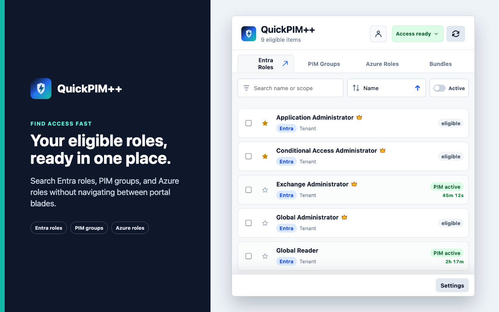
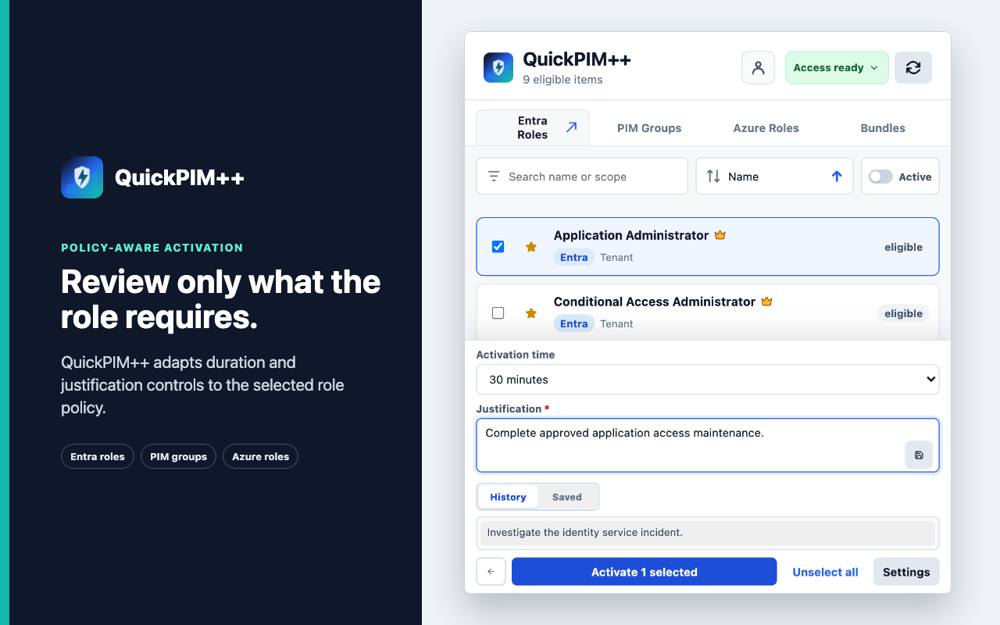
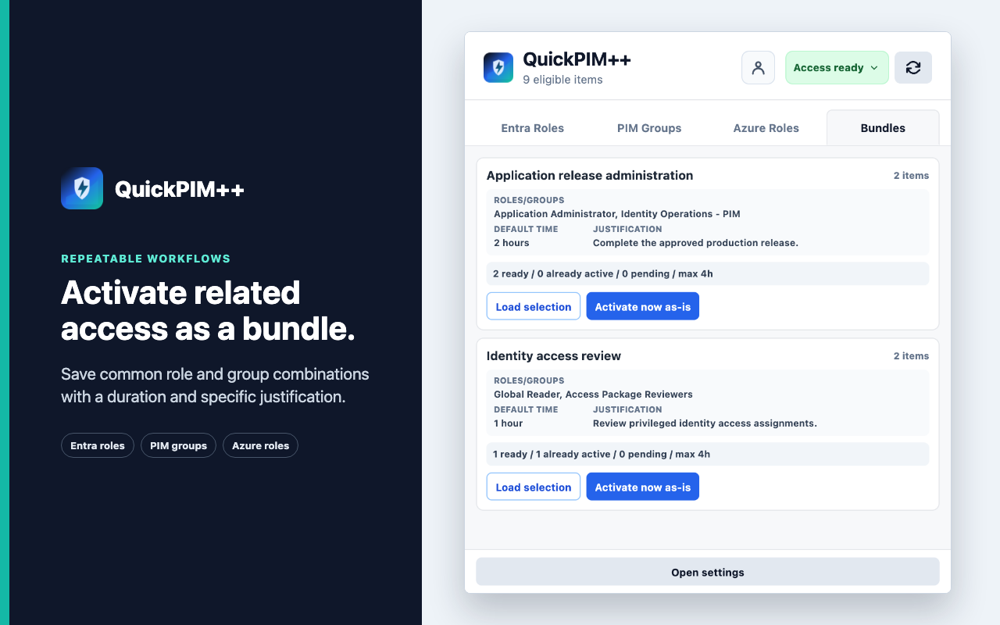
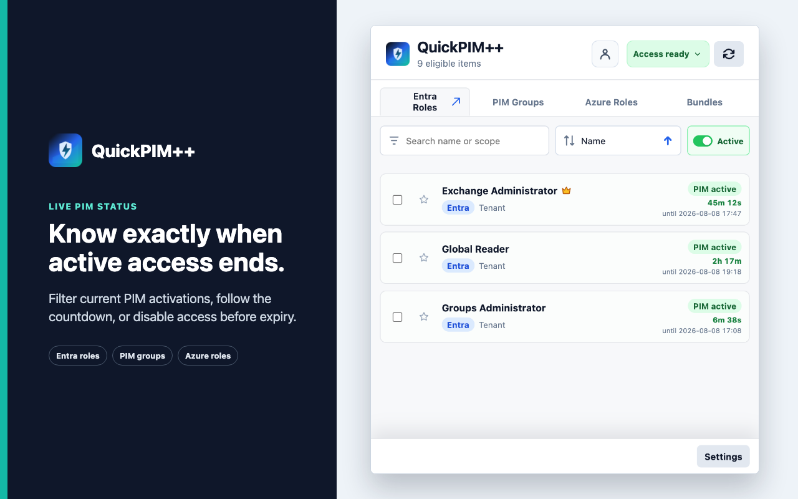
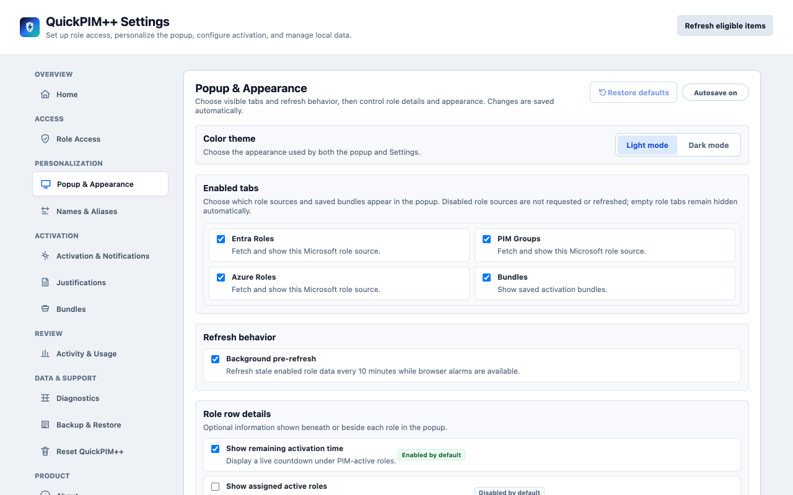

# QuickPIM++

**Activate Microsoft Entra roles, PIM groups, and Azure roles from one fast browser popup.**

QuickPIM++ keeps just-in-time access intact while removing the repeated portal navigation from everyday Privileged Identity Management work.

<p align="center">
  <a href="https://chromewebstore.google.com/detail/quickpim%2B%2B/knhfobbilpoaigbpondpadjdmikhdljn"></a>
  &nbsp;&nbsp;
  <a href="https://microsoftedge.microsoft.com/addons/detail/quickpim/kkonicmefghaignpfelhjfpmpecjgfld"></a>
</p>

Current version: **v2.18.2**



## Find The Access You Need, Faster

Microsoft PIM is built for secure, temporary access, but the portal workflow becomes repetitive when you regularly move between Entra roles, PIM-enabled groups, and Azure resources.

QuickPIM++ brings those eligible assignments into one focused popup. Search for access, select what you need, review only the policy-required inputs, and submit the request without navigating between portal blades.

- **One place for privileged access**: Entra roles, PIM groups, Azure roles, and saved bundles.
- **Policy-aware requests**: only valid durations are offered; justification, ticket, and approval requirements appear when relevant.
- **Clear active access**: see live remaining time, local expiry, request status, and early-disable availability.
- **Repeatable workflows**: favorites, aliases, saved reasons, recent history, and activation bundles reduce repetitive work.
- **Browser-account sync**: useful preferences, aliases, favorites, justifications, bundles, usage, and recent activity can follow official Chrome or Edge installations. Each installation has a stable generated ID that can be renamed, concurrent field and event changes are reconciled without double-counting, and activity records retain their source computer.
- **Local-first design**: no dedicated app registration, manual token entry, or developer-controlled backend.
- **Correct browser edition**: Edge users are guided to the Edge Add-ons edition with a direct, local settings-and-history migration path.

## See It In Action

Click any screenshot to view it at full size.

| Policy-aware activation | Reusable role bundles |
| --- | --- |
| [](docs/images/screenshot-02-popup-activation-1280x800.png) | [](docs/images/screenshot-03-popup-bundles-1280x800.png) |
| Select roles first, then review only the duration and audit inputs their policies require. | Save related roles and groups with a duration and justification, then load or activate the bundle in one step. |

| Live active-access view | Focused, autosaved settings |
| --- | --- |
| [](docs/images/screenshot-04-popup-active-1280x800.png) | [](docs/images/screenshot-05-settings-appearance-1280x800.png) |
| Follow active PIM assignments, see when access ends, and disable supported activations before expiry. | Choose role sources, theme, refresh behavior, row details, notifications, and activation defaults. |

## What QuickPIM++ Handles

### Microsoft Entra Roles

Browse and activate eligible directory roles, including tenant, administrative-unit, and device-scoped assignments. QuickPIM++ resolves friendly role and scope names when Microsoft exposes them and distinguishes PIM activations from permanently assigned roles.

### PIM Groups

Activate eligible member or owner access for PIM-enabled groups. Group names are learned locally for fast display fallback, and active group assignments can be disabled early when Microsoft provides the required schedule identifiers.

### Azure Roles

Work with eligible Azure resource roles across subscriptions, resource groups, management groups, and inherited scopes. QuickPIM++ resolves role definitions and resource names where the captured portal access permits it.

## Built For Daily PIM Work

- Search by role, group, resource, or scope.
- Sort in either direction and keep the last-used order.
- Pin favorites above the rest of the current result set.
- Apply local aliases when organizational names are clearer than Microsoft display names.
- Reuse saved justifications or recent reasons without accepting generic audit responses such as `BAU`, `Admin`, or `needed`.
- Create mixed bundles containing Entra roles, PIM groups, and Azure roles.
- Skip already-active bundle entries and preflight blocked, pending, or policy-limited items.
- Keep activation and deactivation selections separate so each request has one clear intent.
- Track approval, provisioning, completion, denial, failure, and expiry from Settings > Activity & Usage.
- Continue selected PIM access after expiry with a policy-capped scheduled extension.
- Optionally notify when a request changes state or active access is close to expiry.
- Preserve popup selections and request inputs when the popup closes or Microsoft requires an interactive prompt.
- Keep working from cached role data while stale sources refresh in the background.
- Keep convenience data synchronized between signed-in installations of the same Store edition, with per-install controls, user-friendly device names, concurrent activity merging, and a cloud-data purge action.

## A Shorter Path To Activation

1. Install QuickPIM++ from the Chrome Web Store or Microsoft Edge Add-ons.
2. Sign in to the Microsoft Entra admin center or Azure portal with your usual administrative account.
3. Use the popup Refresh action when access needs to be captured or renewed.
4. Choose an Entra role, PIM group, Azure role, or bundle.
5. Select **Continue**, review the allowed duration and required audit inputs, then submit.

QuickPIM++ scans existing Microsoft portal tabs first. When more portal access is needed, it opens only the enabled role-source pages required for recovery in a temporary background tab group and closes them after usable access is captured. If Microsoft requires sign-in, MFA, tenant selection, or another prompt, QuickPIM++ pauses safely and tells you where interaction is required.

## Local-First By Design

QuickPIM++ does not run a developer-controlled service and does not ask you to configure a separate OAuth application.

- Validated Microsoft portal tokens stay in browser session storage and are cleared when the browser session ends.
- Tokens, API caches, learned names, popup drafts, in-progress requests, and notification permission stay local to the installation.
- Useful preferences and bounded convenience data can use the browser account's extension sync service. Sync is enabled by default, can be disabled per installation, and can be purged from Settings. Complete generations are validated before use, concurrent writers are reconciled on a following pass, and quota-limited cloud snapshots never replace a complete local history with a truncated copy. Cloud writes are coalesced and batched; if the browser temporarily rejects a write at its rate limit, QuickPIM++ keeps the local copy and retries after a cooldown.
- Chrome Sync and Microsoft Edge Sync are separate services; Backup & Restore moves data between browser families.
- Microsoft PIM operations go directly to Microsoft Graph or Azure Management.
- The public GitHub API is used only to display project release information in Settings.
- QuickPIM++ does not request browser cookie access and does not sell or send extension data to the developer.
- Runtime messages, JWTs, API destinations, request payloads, imported settings, and surfaced errors are validated or sanitized.

Read the complete [privacy policy](PRIVACY.md) and [security review](SECURITY_REVIEW.md).

## Requirements And Limits

Full functionality requires:

- Microsoft Edge or another Chromium-based browser.
- A Microsoft Entra tenant with Privileged Identity Management.
- An account eligible for at least one supported Entra role, PIM group, or Azure role.
- Microsoft portal access capable of exposing the APIs required by that role source.

QuickPIM++ cannot bypass PIM policy, approval, MFA, authentication-context, licensing, tenant, or Azure RBAC restrictions. Microsoft responses vary by tenant and role type, so some friendly names, policy details, and early-disable controls remain best-effort.

## Technical Reference

The sections below cover source builds, verification, release automation, and repository maintenance. Most users only need one of the Store install buttons at the top of this page.

### Build And Load Locally

Requirements:

- Node.js 24 or newer
- npm 11.6.2
- Microsoft Edge or another Chromium browser

Install dependencies, test, and build:

```bash
npm install
npm test
npm run build
```

Load the production build:

1. Open `edge://extensions` or `chrome://extensions`.
2. Enable **Developer mode**.
3. Choose **Load unpacked**.
4. Select this repository's `dist/` folder.
5. Pin QuickPIM++ to the browser toolbar.

Useful verification commands:

```bash
npm run type-check
npm run test:e2e
npm run check:edge
npm audit --audit-level=low
node scripts/check-version-sync.mjs
```

On a workstation with Microsoft Edge installed, `npm run test:edge` sideloads `dist/` and smoke-tests the popup.

### Release And Store Packaging

`npm run package:stores` creates one verified Chromium MV3 archive:

```text
release/quickpim-plusplus-vX.Y.Z-chromium-stores.zip
```

Chrome Web Store and Microsoft Edge Add-ons currently receive the same immutable archive because the extension uses one compatible manifest and payload. `npm run check:edge` rejects unsupported Edge API use, Chrome-specific Store metadata, or an `update_url` before packaging.

Tagged releases run version synchronization, type checking, tests, dependency audit, production build, package verification, GitHub release attachment, and configured Chrome and Edge Store submissions. The release pipeline fails visibly when required Store credentials are absent rather than silently skipping a target.

The approved listing copy and reusable Store graphics live under `store/`. Run `npm run assets:stores` only when those tracked screenshots or promotional assets need to be regenerated.

See [GitHub Releases](https://github.com/RobinMJD/QuickPIM-PlusPlus/releases) for the changelog and downloadable version history.

### Repository Layout

- `src/`: React, TypeScript, background, popup, Settings, storage, and API source.
- `public/`: static Manifest V3 extension assets.
- `tests/`: unit, component, packaging, and metadata tests.
- `store/`: approved listing copy and generated Store media.
- `docs/images/`: README screenshots and official Store badges.
- `dist/`: ignored production build used for local unpacked testing.
- `release/`: ignored Store upload packages.
- `SECURITY_REVIEW.md`: reviewed threat model, token handling, permissions, storage, and accepted risks.

## Attribution

Concept credit: [Daniel Bradley](https://github.com/DanielBradley1/QuickPIM), who created the original QuickPIM idea.

QuickPIM++ was inspired by that concept, but it is an independent implementation with a fully rewritten application codebase and its own expanded product, data model, activation workflows, interface, tests, packaging, and release pipeline.

## License

This project is licensed under the [MIT License](LICENSE).
